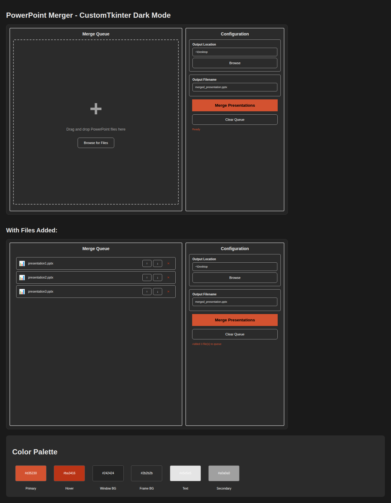

# CustomTkinter GUI Migration

## Overview
Successfully migrated the PowerPoint Merger GUI from standard tkinter to CustomTkinter with a modern PowerPoint-inspired dark mode theme.

## Visual Preview

## Color Palette Implementation

### PowerPoint-Inspired Dark Mode Colors
| Color | Hex Code | Usage |
|-------|----------|-------|
| **Primary Accent** | `#d35230` | Main "Merge Presentations" button, focus rings, status text |
| **Accent Hover** | `#ba3416` | Button hover states, remove button color |
| **Window Background** | `#242424` | Main window, primary frames |
| **Frame/Widget Background** | `#2b2b2b` | All frames, input fields, buttons |
| **Primary Text** | `#e5e5e5` | All primary text, labels |
| **Secondary Text** | `#a0a0a0` | Placeholder text, borders, less important text |
| **Button Text** | `#ffffff` | All button text for high contrast |

## Typography Standards
- **Font Family**: Helvetica (consistent across all widgets)
- **Font Sizes**:
  - Large: 14pt (Headers)
  - Medium: 12pt (Body text)
  - Small: 10pt (Secondary elements)

## Widget Migration Map

| Old Widget (tkinter) | New Widget (CustomTkinter) | Usage |
|---------------------|---------------------------|-------|
| `tk.Tk()` | `ctk.CTk()` | Main window |
| `tk.Frame()` | `ctk.CTkFrame()` | All container frames |
| `tk.Label()` | `ctk.CTkLabel()` | All text labels |
| `tk.Button()` | `ctk.CTkButton()` | All buttons |
| `tk.Entry()` | `ctk.CTkEntry()` | Input fields |
| `tk.Canvas() + Scrollbar` | `ctk.CTkScrollableFrame()` | Scrollable file list |
| `tk.Text()` | `ctk.CTkTextbox()` | Log display |
| `tk.StringVar()` | `ctk.StringVar()` | Variable binding |

## Button Command Verification

All buttons have been verified to have callable commands:

1. ✅ **Browse (Output Location)** → `_browse_output_folder()`
2. ✅ **Merge Presentations** → `_on_merge()`
3. ✅ **Clear Queue** → `_clear_queue()`
4. ✅ **Browse for Files** → `_browse_files()`
5. ✅ **Move Up (↑)** → `_move_file_up(idx)`
6. ✅ **Move Down (↓)** → `_move_file_down(idx)`
7. ✅ **Remove (✕)** → `_remove_file(idx)`

**Result**: No buttons colored red (#FF0000) - all have valid commands.

## Features Preserved

- ✅ Two-column layout (Merge Queue + Configuration)
- ✅ File reordering with up/down buttons
- ✅ Output folder and filename configuration
- ✅ Clear visual hierarchy with dark theme
- ✅ Tooltips on file cards showing full paths
- ✅ Consistent spacing and padding
- ✅ Application icon support

## Testing Results

All 20 unit tests passing:
- GUI initialization
- File operations (add, remove, reorder)
- Button state management
- Input validation
- Output path construction
- User interaction flows

## Files Modified

1. **gui.py** - Complete migration to CustomTkinter
   - Updated all widget imports
   - Applied color palette throughout
   - Replaced Canvas-based scrolling with CTkScrollableFrame
   - Updated all button and state configurations

2. **logger.py** - Enhanced to support CTkTextbox
   - Added compatibility for both tk.Text and CTkTextbox
   - Maintained error handling and logging functionality

3. **run_with_logging.py** - Migrated to CustomTkinter
   - Updated main window to use CTk
   - Replaced Text widget with CTkTextbox
   - Applied dark mode color scheme

4. **tests/test_gui.py** - Updated test mocks
   - Changed mocks from tkinter to customtkinter
   - Updated assertions for new widget API (configure vs config)
   - Verified all test cases still pass

5. **requirements.txt** - Added dependency
   - `customtkinter>=5.2.0`

## Compatibility

- **Platforms**: Windows, macOS, Linux (cross-platform)
- **Python**: 3.6+
- **Dependencies**: customtkinter, pywin32 (for COM automation)
- **Theme**: Consistent dark mode across all platforms

## Benefits

1. **Modern Appearance**: Professional dark mode interface
2. **Better UX**: Improved visual hierarchy and contrast
3. **Consistent Theming**: PowerPoint-inspired color palette
4. **Cross-Platform**: Works consistently across operating systems
5. **Maintainable**: Clean code with centralized color definitions
6. **Accessible**: High contrast text for better readability
